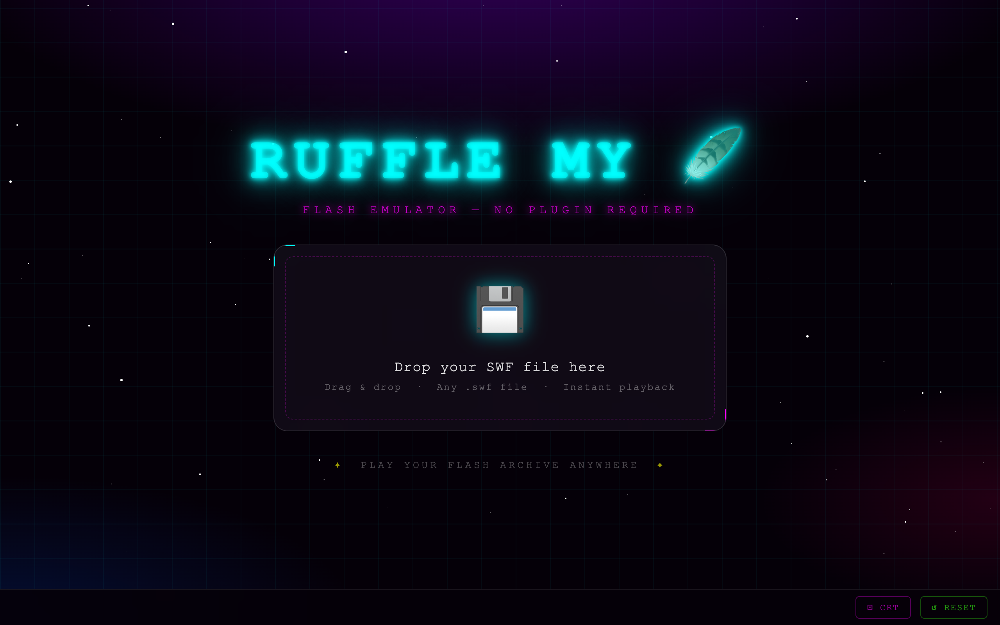

# Ruffle My 🪶

> Play your Flash archive anywhere — no plugin required.

**Ruffle My 🪶** is a dead-simple, single-page Flash emulator powered by [Ruffle.rs](https://ruffle.rs). Drop any `.swf` file onto the page and it plays instantly in your modern browser. No setup, no plugins, no nonsense — just pure nostalgic vibes.

🌐 **Live site:** [flash.wemiller.com](https://flash.wemiller.com)



---

## ✨ Features

- **Drag & Drop** — Drop any `.swf` file onto the page to play it instantly
- **Click to Browse** — Prefer a file picker? Click the drop zone
- **Swap on the Fly** — Drop a new file anytime to replace the current one
- **Full-Screen Playback** — The SWF fills the browser window above a clean bottom bar
- **Bottom Control Bar** — Filename, CRT toggle, and Reset all live below the content — never overlapping it
- **CRT Filter** — Toggle retro scanlines and vignette for extra nostalgia
- **Reset** — One click to return to the start screen
- **Glassmorphic UI** — Neon synthwave aesthetics with CSS animations
- **PWA / Install to Home Screen** — Works as an installable app on iOS and Android
- **Auto-Updates** — CI keeps Ruffle pinned to the latest version weekly

---

## 🚀 Quick Start

### Online

Visit [flash.wemiller.com](https://flash.wemiller.com), drag and drop a `.swf` file — done.

### iOS / Android (PWA)

Open the site in Safari (iOS) or Chrome (Android), then:

- **iOS:** Share → Add to Home Screen
- **Android:** Browser menu → Add to Home Screen / Install App

The app opens full-screen with no browser chrome, just like a native app. The service worker caches the app shell so it loads instantly on repeat visits.

### Docker (local server)

```bash
docker compose up -d
```

Then open [http://localhost:8420](http://localhost:8420)

> Port **8420** — memorable, unique, and ready to roll.

### Just open the file

```bash
open index.html
```

Most browsers will run it directly from the filesystem. If Ruffle's WASM files don't load offline, see below.

---

## 📡 Offline / Self-Hosted Ruffle

By default the page loads Ruffle from the unpkg CDN (requires an internet connection on first visit; the service worker and browser cache handle repeat visits). For fully air-gapped or offline use:

1. Download the **self-hosted** Ruffle release from [ruffle.rs/#releases](https://ruffle.rs/#releases)
2. Extract the zip into a folder named `ruffle/` next to `index.html`
3. Edit `index.html` and swap the CDN script tag for:

```html
<script src="ruffle/ruffle.js"></script>
```

---

## 📁 Project Structure

```
ruffle-me/
├── index.html                        # The whole app — one file
├── manifest.json                     # PWA manifest (name, icons, display mode)
├── sw.js                             # Service worker — caches app shell offline
├── icons/
│   ├── apple-touch-icon.png          # 180×180 iOS home screen icon
│   ├── icon-192.png                  # PWA icon (Android / Chrome)
│   └── icon-512.png                  # PWA icon large (maskable)
├── docker-compose.yml                # Serve locally with nginx on port 8420
├── nginx.conf                        # nginx config with COOP/COEP headers
├── CNAME                             # Custom domain (flash.wemiller.com)
├── .nojekyll                         # Tells GitHub Pages to skip Jekyll
└── .github/
    └── workflows/
        ├── pages.yml                 # Auto-deploy to GitHub Pages on push
        └── update-ruffle.yml         # Weekly Ruffle version bump
```

---

## 🤖 CI / Automation

| Workflow | Trigger | What it does |
|---|---|---|
| `pages.yml` | Push to `main` | Deploys to GitHub Pages |
| `update-ruffle.yml` | Every Monday 00:00 UTC | Bumps Ruffle CDN version to latest |

The update workflow:
1. Fetches the latest `@ruffle-rs/ruffle` version from npm
2. Updates the `<script>` tag in `index.html` to pin that version
3. Commits and pushes only if there's an actual change

No human intervention needed — Ruffle stays fresh automatically.

---

## 🌐 GitHub Pages Setup

After pushing to GitHub:

1. Go to **Settings → Pages** in your repo
2. Set **Source** to `GitHub Actions`
3. The `pages.yml` workflow handles the rest on every push to `main`

For the custom domain (`flash.wemiller.com`), add a DNS `CNAME` record pointing to `<your-github-username>.github.io`.

---

## 🎨 Tech Stack

| Layer | Tech |
|---|---|
| Flash emulation | [Ruffle.rs](https://ruffle.rs) (Rust + WASM) |
| UI | Vanilla HTML / CSS / JS — zero dependencies |
| PWA | Web App Manifest + Service Worker |
| Hosting | GitHub Pages + nginx (Docker) |
| CI | GitHub Actions |

---

## ⚙️ Ruffle Configuration

The following options are applied globally before Ruffle loads:

| Option | Value | Effect |
|---|---|---|
| `letterbox` | `"on"` | Preserves the SWF's original aspect ratio with letterboxing |
| `splashScreen` | `false` | Skips Ruffle's own loading screen for a cleaner experience |
| `openUrlMode` | `"deny"` | Blocks any URL-navigation attempts made by the SWF |

---

## 🕹 How to Use

1. Open the site
2. Drag any `.swf` file onto the glowing drop zone (or click to browse)
3. Watch it come to life — the SWF fills the screen above the control bar
4. The **bottom bar** shows the loaded filename on the left
5. Toggle **CRT** for the full retro monitor effect (scanlines + vignette)
6. Drop another file anytime — it swaps instantly
7. Hit **Reset** to go back to the start

---

Made with ❤️ and nostalgia. Powered by [Ruffle.rs](https://ruffle.rs).
